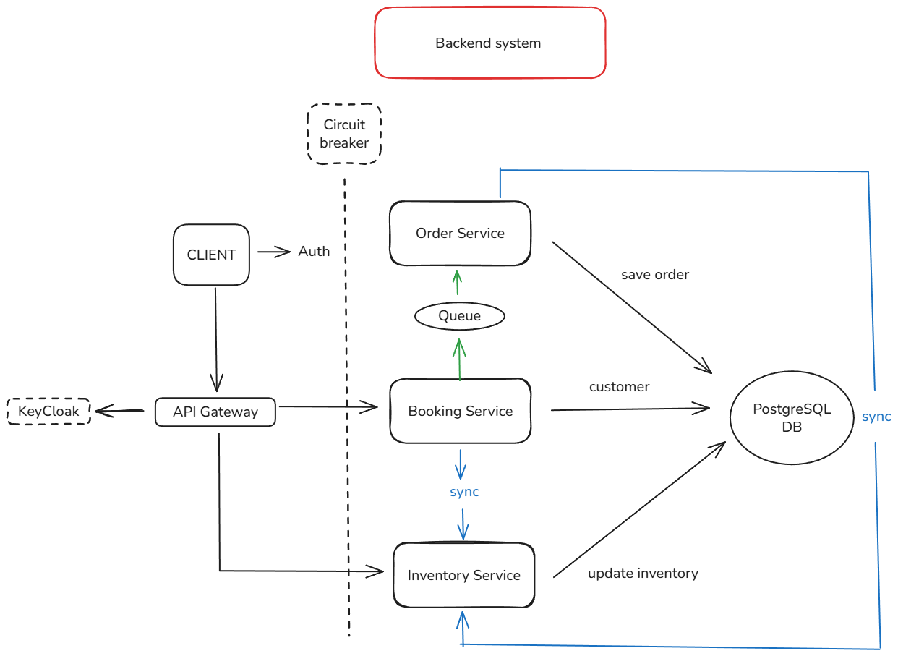

Tickets purchasing for events based on microservices

## Architecture design



# TECH STACK
This project is built using a modern microservice-based architecture leveraging the following technologies:

## Backend
- **Java 21** – Provides modern language features and performance improvements for building robust backend applications.
- **Spring Boot 3** – Core framework for developing production-grade Spring-based microservices with minimal configuration.
- **Maven** – Dependency management and build automation tool used for packaging and managing project lifecycle.
- **Lombok** – Reduces boilerplate code by automatically generating getters, setters, constructors, and more through annotations.
- **Resilience4j** – Implements fault tolerance patterns such as circuit breakers, retries, and rate limiters to improve service resilience.

## Database
- **PostgreSQL** – Relational database management system used for persistent data storage and transactional operations.
- **Flyway** – Handles database versioning and schema migrations in a controlled and automated way.

## Messaging
- **Apache Kafka** – Distributed streaming platform used for asynchronous communication and event-driven data flow between services.

## Security & Authentication
- **Keycloak** – Open-source identity and access management solution providing authentication, authorization, and single sign-on (SSO).

## Containerization
- **Docker** – Used to containerize microservices, ensuring environment consistency and simplifying deployment and scalability.

## Monitoring & Observability
- Collect metrics from your microservices (latencies, counters, system usage, etc.).
- Centralize metrics in Prometheus.
- Visualize metrics using Grafana.
- Facilitate alerts, dashboards, and proactive monitoring.
  
## Architecture
- **Spring Boot + Actuator: Each microservice exposes metrics at the `/actuator/prometheus` endpoint.  
- **Prometheus**: Periodically scrapes these endpoints and stores the collected metrics.  
- **Grafana**: Configured with Prometheus as a data source to display dashboards with relevant metrics (latency, request counts, memory usage, etc.).

## Deployment
Follow these steps to deploy the monitoring stack:

```bash
1. Clone your repository and navigate to the `monitoring` folder:  
   git clone https://github.com/CarlosMoyaT/CarlosMoyaT-Spring-boot-microservicios.git  
   cd CarlosMoyaT-Spring-boot-microservicios/monitoring
   docker compose up -d
```


# InventoryService
Handles the information of the event and the venue.


# OrderService
Consume the Kafka messages that are produced in the booking service.


# BookingService
A request is received to place an order for an event for a customer. The booking service will verify that the customer actually exists, and if so, it will retrieve from the inventory service information about the specific event, remaining capacity, ticket price...
produces messages from Kafka to orderservice.


